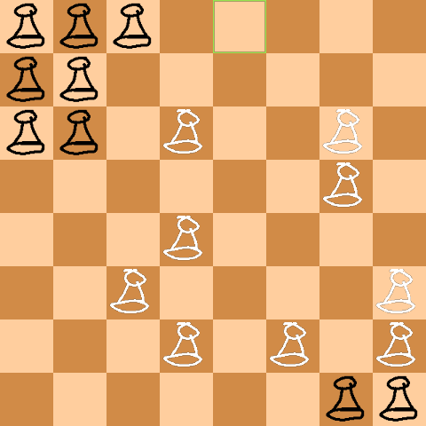

# SDLGameTest
### A board game that uses chess board, chess pawns and not quite chess rules


## Tools
This project uses [SDL2](https://github.com/libsdl-org/SDL)
and [SDL_image](https://github.com/libsdl-org/SDL_image)
for rendering the board.

## Rules
Whites go first. Pawns can only be moved one step at a time
horizontally or vertically. First player to move all pawns to
opponent's starting location wins.

## Controls
Drag and drop white pawns to make a turn. Alternatively, use arrows to navigate
the board and WASD to move pawns in corresponding directions.

## AI
Ai prioritizes leaving the starting area, then moving to accessible
target squares one pawn at a time. If no squares are accessible,
it moves its pawns either down or to the right, waiting for the path to clear.

AI can stall the game if it can't proceed by moving any pawn back and forth.
AI can also force a draw by locking white pawns in the bottom right corner,
forcing player to leave that area sooner.


## Build
### For Linux:

`# apt-get install libsdl2-dev libsdl2-image-dev` (for Debian-based systems,
[more](https://lazyfoo.net/tutorials/SDL/01_hello_SDL/linux/index.php)
[info](https://lazyfoo.net/tutorials/SDL/06_extension_libraries_and_loading_other_image_formats/linux/index.php))
```
$ mkdir build
$ cd build
$ cmake ..
$ make
```

### For Windows:
Tested with Build Tools for Visual Studio. Built version is attached to the repository tag.

* Download [SDL2](https://github.com/libsdl-org/SDL) and [SDL2_image](https://github.com/libsdl-org/SDL_image)
* Run cmake with flags
```
-DSDL2_DIR=<path/to/SDL2/cmake> -DSDL2_IMAGE_DIR=<path/to/SDL2_image/cmake>
```
* Compile project


* Add <SDL2_dir>/lib/x86 <SDL2_image_dir>/lib/x86 (or x64) and to PATH environment variable
* OR
* add either x86 or x64 SDL2.dll and SDL2_image.dll to build directory (easier)